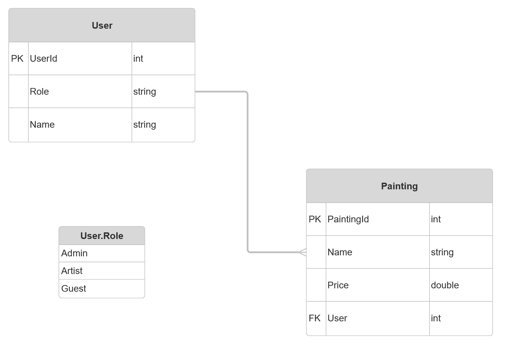

# A Gallery API
- A Web App made with .NET to help artists create and persist their painting inventory to a backend

# Team members
- Ali A.

# Project Requirements
- Application must build and run
- Unit Testing (20% code coverage for Service layer)
- API must serve the artists with most possible services
- Backend hosted on Azure Cloud Service

# Tech Stack
- ASP.NET Core
- Entity Framework Core
- Swagger
- Azure SQL Server

# User Stories
- User should be able to register if they do not have an account
- User should be able to create a new painting or a list of paintings
- User should be able to view current list of paintings
- User should be able to retrieve a specific painting by id
- User should be able to delete a specific painting by id
- Users should be able to deactivate (delete) their accounts

# Tables

# MVP Goals
- User can create a new account with a specific role
    - Admin
    - Artist
    - Guest
- User can add a new painting. Must be
    - Admin
    - Artist
- User can retrieve/update/delete a painting. Must be
    - Admin
    - Artist
- User can display all accounts. Must be
    - Admin
- Users can delete their accounts. Any role
- User can display all paintings. Any role

# Stretch Goals
- Implement login/logout functionality
- User authentication and password encryption
- Login using google, facebook, or other external accounts
- Possibility of painting sharing feature where many artists collaborate to create one or multiple paintings

